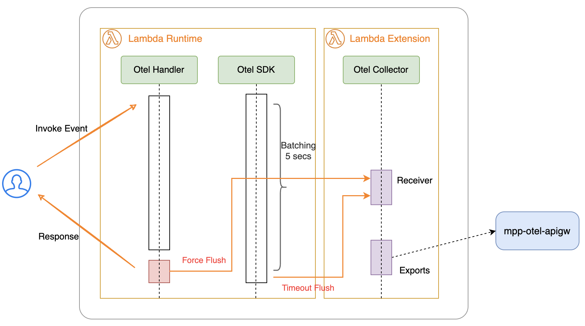

# opentelemetry-lambda

A Go library that provides OpenTelemetry instrumentation for AWS Lambda functions. This library simplifies the process of adding distributed tracing to your AWS Lambda functions using OpenTelemetry.

## Tracing Solution

OpenTelemetry (OTel) tracing solution for AWS Lambda using the public network (without VPC):

- Use the Lambda collector extension to asynchronously collect tracing data.
Send the collected data to the MPP API Gateway's DNS endpoint.
- Use the AWS API Gateway execution role to control access.
- Use SigV4 authorization for authentication.



### Details

- **Use MPP trace library** to instrument the existing Lambda function.
- [Optional] Use **OtelAWS** to instrument other AWS services with OpenTelemetry.
- Configure **SigV4 authorization** in the AWS Lambda collector with the following settings:
  ```yaml
  extensions:
    sigv4auth:
      region: us-west-2
      service: execute-api
      assume_role:
        arn: "arn:aws:iam::xxxxxx:role/mpp-api-gateway-otel-ingest"
        sts_region: "us-west-2"
  ```
- Modify the runtime and attach the **otel-collector layer** to the Lambda function.
- **MPP** should grant trust to all AWS accounts under IAM, authorize them to use the **execute-api** service, and configure API Gateway to use **AWS IAM** as the authorizer.


Reference:
**[Sigv4auth]**
- https://github.com/open-telemetry/opentelemetry-collector-contrib/tree/main/extension/sigv4authextension
- https://aws-otel.github.io/docs/sigv4


## Features

- Easy integration with AWS Lambda functions
- Automatic context propagation
- Custom span creation and management
- Configurable through environment variables
- Compatible with OpenTelemetry collectors

## Installation

```bash
go get github.com/aloong-planet/opentelemetry-lambda/trace
go get go.opentelemetry.io/contrib/instrumentation/github.com/aws/aws-lambda-go/otellambda
```

## Environment Variables

| Name | Type | Default | Description |
|------|------|---------|-------------|
| OTEL_SERVICE_NAME | string | lambda function name | Service name for traces |
| OTEL_EXPORTER_OTLP_ENDPOINT | string | http://localhost:4318 | OTLP endpoint |
| OTEL_EXPORTER_OTLP_PROTOCOL | string | http/protobuf | Protocol for OTLP exporter |

## Quick Start

Here's a simple example of how to use the library with an API Gateway Lambda function:

```go
import (
    "context"
    "net/http"
    
    trace "github.com/aloong-planet/opentelemetry-lambda/trace"
    traceconfig "github.com/aloong-planet/opentelemetry-lambda/trace/config"
    "github.com/aws/aws-lambda-go/events"
)

func lambdaHandler(ctx context.Context, request events.APIGatewayProxyRequest) (interface{}, error) {
    // Create a new span for this handler
    ctx, span := trace.StartLambdaSpan(ctx, request)
    defer span.End()
    
    // Your function logic here
    
    return events.APIGatewayProxyResponse{
        StatusCode: http.StatusOK,
        Body:       "Hello, OpenTelemetry!",
    }, nil
}
```

## Documentation

For more detailed documentation and examples, please refer to the [trace/README.md](trace/README.md) file.

## License

MIT License

## Contributing

Contributions are welcome! Please feel free to submit a Pull Request.
